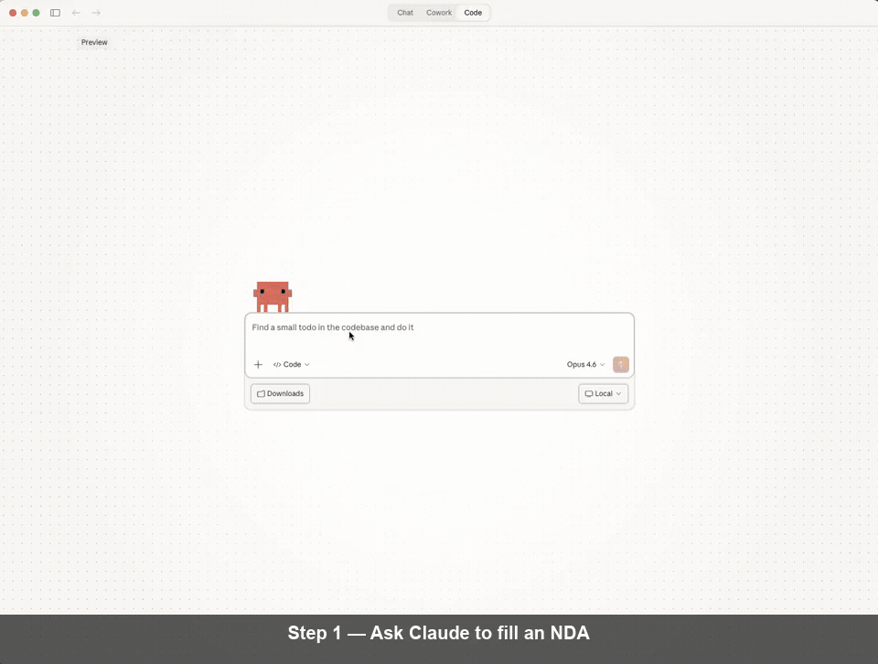

# OpenAgreements

[](https://www.npmjs.com/package/open-agreements)
[](https://npmjs.org/package/open-agreements)
[](https://opensource.org/licenses/MIT)
[](https://skills.sh)
[](https://github.com/open-agreements/open-agreements/actions/workflows/ci.yml)
[](https://openagreements.openstatus.dev/)
[](https://app.codecov.io/gh/open-agreements/open-agreements)
[](https://github.com/open-agreements/open-agreements/stargazers)
[](https://vitest.dev/)
[](./scripts/validate_openspec_coverage.mjs)

Fill standard legal agreement templates and produce signable DOCX files. Templates cover NDAs, cloud terms, employment docs, contractor agreements, SAFEs, and NVCA financing documents.

Built by the team behind [UseJunior.com](https://usejunior.com) — in production at Am Law 100 firms.

<p align="center">
  
</p>

> *Demo: Claude fills a Common Paper Mutual NDA in under 2 minutes. Sped up for brevity.*

## Quality and Trust Signals

- CI runs on pull requests and pushes to `main`.
- Live service health is published via OpenStatus at `openagreements.openstatus.dev`.
- Coverage is published to Codecov with repository-defined patch/project gates in `codecov.yml`.
- The active JS test framework is Vitest, with JUnit test results uploaded for Codecov test analytics.
- OpenSpec scenario traceability is enforced via `npm run check:spec-coverage`. For a local matrix export, run `npm run check:spec-coverage -- --write-matrix integration-tests/OPENSPEC_TRACEABILITY.md`.
- Recipe source drift canary (`npm run check:source-drift`) verifies expected source hash plus structural replacement/normalize anchors.
- Assumption-level regressions are tracked in `docs/assumptions.md` and validated via targeted regression tests + CI gates.
- LibreOffice-powered DOCX visual rendering uses a pinned build config on macOS (`config/libreoffice-headless.json`); run `npm run check:libreoffice` before visual Allure evidence tests.
- Maintainer: [Steven Obiajulu](https://www.linkedin.com/in/steven-obiajulu/) (MIT-trained mechanical engineer; Harvard Law trained lawyer).

## How It Works

```
1. Pick a template          2. Answer questions            3. Get a signed-ready DOCX
┌─────────────────────┐     ┌─────────────────────────┐    ┌─────────────────────┐
│ $ open-agreements   │     │ Party 1: Acme Corp      │    │                     │
│   fill mutual-nda   │ ──▶ │ Party 2: Beta Inc       │ ──▶│  mutual-nda.docx    │
│                     │     │ Governing law: Delaware  │    │  ✓ All fields filled│
└─────────────────────┘     └─────────────────────────┘    └─────────────────────┘
```

OpenAgreements supports two execution modes with different trust boundaries:

- Hosted remote MCP connector (`https://openagreements.ai/api/mcp`) for fast setup in Claude.
- Fully local package execution (`npx`, global install, or local stdio MCP package) for machine-local workflows.

There is no global default mode recommendation. Choose based on document sensitivity, internal policy, and workflow speed needs. See `docs/trust-checklist.md` for a 60-second data-flow summary.

### Quick Decision

- If your document is sensitive, use fully local package execution.
- If you prioritize convenience, use the hosted remote MCP connector.

## Use with Claude Code

OpenAgreements works as a [Claude Code plugin](https://docs.anthropic.com/en/docs/claude-code/plugins) and [Agent Skill](https://agentskills.io). No pre-installation required — Claude downloads and runs the CLI on demand via `npx`.

### Option 1: Agent Skill (recommended)

```bash
npx skills add open-agreements/open-agreements
```

Then ask Claude to draft an agreement:

```
> Draft an NDA between Acme Corp and Beta Inc
```

Claude discovers available templates, interviews you for field values, and renders a signed-ready DOCX.

### Option 2: Direct with Claude Code

If you have Node.js >= 20, just ask Claude:

```
> Fill the Common Paper mutual NDA for my company
```

Claude runs `npx -y open-agreements@latest list --json` to discover templates, then `npx -y open-agreements@latest fill <template>` to render the output. Zero install.

### Option 3: CLI

```bash
# Install globally
npm install -g open-agreements

# List available templates
open-agreements list

# Fill a template
open-agreements fill common-paper-mutual-nda -d values.json -o my-nda.docx
```

### What Happens

1. Claude runs `list --json` to discover available templates and their fields
2. Claude interviews you for field values (grouped by section, up to 4 questions per round)
3. Claude runs `fill <template>` to render a DOCX preserving all original formatting
4. You review and sign the output document

## Use with Cursor

This repository includes a Cursor plugin manifest with MCP wiring:

- Plugin manifest: `.cursor-plugin/plugin.json`
- MCP config: `mcp.json`
- Skill: `skills/open-agreements/SKILL.md`

The default MCP setup in `mcp.json` includes:

- Hosted OpenAgreements MCP connector (`https://openagreements.ai/api/mcp`)
- Local SafeDocX stdio server (`npx -y @usejunior/safedocx`)

To publish this plugin in Cursor Marketplace, submit this repository at:

- https://cursor.com/marketplace/publish

## Templates

28 templates across three tiers. Run `open-agreements list` for the full inventory.

| Tier | Count | Source | How It Works |
|------|-------|--------|--------------|
| Internal templates | 17 | [Common Paper](https://commonpaper.com), [Bonterms](https://bonterms.com), OpenAgreements | Shipped in package, CC BY 4.0 |
| External templates | 4 | [Y Combinator](https://www.ycombinator.com/documents) | Vendored unchanged, CC BY-ND 4.0 |
| Recipes | 7 | [NVCA](https://nvca.org/model-legal-documents/) | Downloaded on demand (not redistributable) |

**Internal templates** (NDAs, cloud terms, employment forms, contractor agreements, etc.) are CC BY 4.0 — we ship the DOCX with `{tag}` placeholders.

**External templates** (YC SAFEs) are CC BY-ND 4.0 — we vendor the original unchanged. The filled output is a transient derivative on your machine.

**Recipes** (NVCA financing documents) are freely downloadable but not redistributable — we ship only transformation instructions and download the source DOCX from nvca.org at runtime.

### Guidance Extraction

Source documents contain expert commentary — footnotes, drafting notes, `[Comment: ...]` blocks — written by domain specialists (e.g., securities lawyers). The recipe cleaner removes this content to produce a fillable document, but can also extract it as structured JSON:

```bash
open-agreements recipe clean source.docx -o cleaned.docx \
  --recipe nvca-indemnification-agreement \
  --extract-guidance guidance.json
```

This produces a `guidance.json` with every removed footnote, comment, and drafting note tagged by source type and document position. The guidance is a local-only artifact (not committed or shipped) that AI agents or human authors can reference while filling the form. See [Adding Recipes — Guidance Extraction](docs/adding-recipes.md#guidance-extraction) for format details.

**Why programmatic extraction?** The source document is the single source of truth. Re-running extraction after a publisher update produces fresh guidance with zero manual effort, preserves the exact language of domain experts, and captures everything — an AI can summarize on the fly, but cannot recover discarded content.

Each template is a self-contained directory:

```
content/templates/<name>/
├── template.docx     # DOCX with {tag} placeholders
├── metadata.yaml     # Fields, license, source, attribution
└── README.md         # Template-specific documentation
```

## CLI Commands

### `fill <template>`

Render a filled DOCX from a template.

```bash
# Using a JSON data file
open-agreements fill common-paper-mutual-nda -d data.json -o output.docx

# Using inline --set flags
open-agreements fill common-paper-mutual-nda --set party_1_name="Acme Corp" --set governing_law="Delaware"
```

### `validate [template]`

Run the validation pipeline on one or all templates.

```bash
open-agreements validate                          # All templates
open-agreements validate common-paper-mutual-nda  # One template
```

### `list`

Show available templates with license info and field counts.

```bash
open-agreements list

# Machine-readable JSON output (for agent skills and automation)
open-agreements list --json
```

## Contracts Workspace CLI (Separate Package)

OpenAgreements now includes a sibling package for repository/workspace operations:

- Package: `@open-agreements/contracts-workspace`
- Binary: `open-agreements-workspace`
- Docs: `docs/contracts-workspace.md`

This package is intentionally separate from `open-agreements` so teams can adopt:

- template filling only
- workspace management only
- or both together

Core workspace features:

- topic-first `init` planning (minimal suggested structure with top-level domains)
- forms catalog with URL + SHA-256 validation
- YAML status indexing and linting with filename-driven `_executed` status

The v1 model is filesystem-only and works in locally synced cloud-drive folders (for example, Google Drive sync). No Drive API/OAuth integration is required.

## Local MCP for Workspace Demo

For local connector demos, there is a local stdio MCP package:

- Package: `@open-agreements/contracts-workspace-mcp`
- Binary: `open-agreements-workspace-mcp`
- Docs: `docs/contracts-workspace.md`

Quick start:

```bash
npm run build:workspace-mcp
node packages/contracts-workspace-mcp/bin/open-agreements-workspace-mcp.js
```

## Website (Vercel)

A static marketing site is generated from `site/` with Eleventy.

- Entry points: `site/index.njk`, `site/templates.njk`, `site/template-detail.njk`
- Styles: `site/styles.css`
- Demo media: `site/assets/demo-fill-nda.gif`
- Deployment config: `vercel.json`
- Discovery outputs (generated during `npm run build:site`): `_site/llms.txt`, `_site/llms-full.txt`, `_site/sitemap.xml`, `_site/robots.txt`

Local preview:

```bash
npm run build:site
python3 -m http.server 8080 --directory _site
```

Then open `http://localhost:8080`.

Vercel deploy notes:

- Import this repository in Vercel
- Keep project root as repo root
- The included `vercel.json` deploys `_site/` as static output

## Optional Content Roots (Future-Proofing)

To support logical unbundling as form libraries grow, `open-agreements` can load content from additional roots via:

- env var: `OPEN_AGREEMENTS_CONTENT_ROOTS`
- format: path-delimited list of absolute/relative directories (for example, `dirA:dirB` on macOS/Linux)
- expected structure under each root: `templates/`, `external/`, and/or `recipes/` (or nested under `content/`)

Lookup precedence is:

1. roots in `OPEN_AGREEMENTS_CONTENT_ROOTS` (in listed order)
2. bundled package content (default fallback)

This keeps default installs simple while allowing advanced users to move large content libraries outside the core package.

## Contributing

See [CONTRIBUTING.md](CONTRIBUTING.md) for how to add templates, recipes, and other improvements.

- [Adding templates](docs/adding-templates.md) (CC BY 4.0 / CC0 sources)
- [Adding recipes](docs/adding-recipes.md) (non-redistributable sources)
- [Employment source policy](docs/employment-source-policy.md) (trust and terms classifications)
- [Code of Conduct](CODE_OF_CONDUCT.md) (community expectations and enforcement)

## Releasing

Releases are automated through GitHub Actions using npm trusted publishing (OIDC) with provenance enabled.

1. Update version with `npm version patch` (or `minor` / `major`)
2. Push commit + tag with `git push origin main --tags`
3. The `Release` workflow publishes from the tag after running build, validation, tests, and package checks

Workflow guardrails:

- tag must match `package.json` version (for example, `v0.1.1`)
- release commit must be contained in `origin/main`
- publish fails if that npm version already exists

## Architecture

- **Language**: TypeScript
- **DOCX Engine**: [docx-templates](https://www.npmjs.com/package/docx-templates) (MIT)
- **CLI**: [Commander.js](https://www.npmjs.com/package/commander)
- **Validation**: [Zod](https://www.npmjs.com/package/zod) schemas
- **Skill Pattern**: Agent-agnostic `ToolCommandAdapter` interface

```
content/                    # All content directories
├── templates/              # Internal templates (CC BY 4.0)
├── external/               # External templates (CC BY-ND 4.0)
└── recipes/                # Recipes (downloaded at runtime)

src/                        # TypeScript source + collocated unit tests
├── cli/                    # Commander.js CLI
├── commands/               # fill, validate, list, recipe, scan
├── core/
│   ├── engine.ts           # docx-templates wrapper
│   ├── metadata.ts         # Zod schemas + loader
│   ├── recipe/             # Recipe pipeline (clean → patch → fill → verify)
│   ├── external/           # External template support
│   ├── validation/         # template, license, output, recipe
│   └── command-generation/
│       ├── types.ts        # ToolCommandAdapter interface
│       └── adapters/       # Claude Code adapter
└── index.ts                # Public API

integration-tests/          # Integration and end-to-end tests
```

## Resources

- [Claude Code Documentation](https://docs.anthropic.com/en/docs/claude-code)
- [Claude Code Plugins Guide](https://docs.anthropic.com/en/docs/claude-code/plugins)
- [Agent Skills Specification](https://agentskills.io)

## License

MIT

Template content is licensed by their respective authors — CC BY 4.0 (Common Paper, Bonterms), CC BY-ND 4.0 (Y Combinator), or proprietary (NVCA, downloaded at runtime). See each template's `metadata.yaml` for details.

## Disclaimer

This tool generates documents from standard templates. It does not provide legal advice. No affiliation with or endorsement by Common Paper, Bonterms, Y Combinator, NVCA, or any template source is implied. Consult an attorney for legal guidance.
