<p align="center">
  
</p>

# OpenAgreements

[](https://www.npmjs.com/package/open-agreements)
[](https://npmjs.org/package/open-agreements)
[](https://opensource.org/licenses/Apache-2.0)
[](https://github.com/open-agreements/open-agreements/actions/workflows/ci.yml)
[](https://app.codecov.io/gh/open-agreements/open-agreements)
[](https://socket.dev/npm/package/open-agreements)
[](https://github.com/open-agreements/open-agreements/stargazers)
[](https://skills.sh)
[](https://openagreements.openstatus.dev/)
[](https://packagephobia.com/result?p=open-agreements)

[English](https://github.com/open-agreements/open-agreements/blob/main/README.md) | [Español](https://github.com/open-agreements/open-agreements/blob/main/README.es.md) | [简体中文](https://github.com/open-agreements/open-agreements/blob/main/README.zh.md) | [Português (Brasil)](https://github.com/open-agreements/open-agreements/blob/main/README.pt-br.md) | [Deutsch](https://github.com/open-agreements/open-agreements/blob/main/README.de.md)

Fill standard legal agreement templates and get signable DOCX files. OpenAgreements includes 40+ templates across NDAs, cloud service agreements, employment docs, contractor agreements, SAFEs, and NVCA financing documents.

Works with Claude Code, Gemini CLI, Cursor, and local MCP or CLI workflows.

[Propose a Form Source](https://github.com/open-agreements/open-agreements/issues/new?template=form-source-proposal.yml) · [Request a Feature](https://github.com/open-agreements/open-agreements/issues/new?template=general-enhancement.yml) · [Report an Issue](https://github.com/open-agreements/open-agreements/issues/new/choose)

## Who this is for

OpenAgreements starts with standard forms teams already recognize: Common
Paper, Bonterms, NVCA model documents, and YC SAFE templates. It is for
small-business legal teams, founders, and the agents helping them who need
repeatable agreement filling with source, license, and validation context kept
close to the document.

## Contents

{{CONTENTS}}

<p align="center">
  
</p>

> *Demo: Claude fills a Common Paper Mutual NDA in under 2 minutes. Sped up for brevity.*

## How It Works

```mermaid
%%{init: {"flowchart": {"htmlLabels": true, "curve": "basis", "nodeSpacing": 30, "rankSpacing": 50}, "themeVariables": {"fontSize": "14px"}} }%%
flowchart LR
    InputLeft["<b>Catalog + values</b><br/>Common Paper · Bonterms ·<br/>NVCA · YC SAFE<br/><br/>party info · dates · terms"]

    subgraph Server["open-agreements — local MCP server"]
        direction LR

        subgraph Discover["<b>1. Discover</b>"]
            direction TB
            DiscTool["<code>list_templates(cursor, limit)</code><br/><code>get_template(template_id)</code>"]
        end

        subgraph Fill["<b>2. Fill</b>"]
            direction TB
            FillTool["<code>fill_template(<br/>&nbsp;&nbsp;template, values,<br/>&nbsp;&nbsp;output_path, return_mode)</code>"]
        end

        subgraph Sign["<b>3. Sign</b>"]
            direction TB
            SignTool["<code>send_for_signature(<br/>&nbsp;&nbsp;file_path, signers,<br/>&nbsp;&nbsp;document_name, api_key)</code>"]
        end

        subgraph Track["<b>4. Track</b>"]
            direction TB
            TrackTool["<code>check_signature_status(<br/>&nbsp;&nbsp;envelope_id, api_key)</code>"]
        end

        Discover --> Fill
        Fill --> Sign
        Sign -->|envelope_id| Track
    end

    OutputRight["<b>Signable .docx</b><br/>then <b>signed .pdf</b><br/>on envelope completion"]

    DocuSign["<b>DocuSign</b><br/>draft · review · signers · artifact"]

    subgraph Client [" "]
        direction TB
        Prompt["<b>Prompt</b><br/>'Send a Mutual NDA to acme@example.com'"]
        Agent["<b>Coding agent / MCP client</b><br/>Claude Code · Cursor · Gemini CLI"]
        Prompt --> Agent
    end

    InputLeft --> Discover
    Track --> OutputRight
    SignTool <--> DocuSign
    TrackTool <--> DocuSign
    Agent <-->|tool call / tool result| Server

    classDef io fill:#f5f5f5,stroke:#888,color:#222
    classDef server fill:#eff6ff,stroke:#3b82f6,color:#1e3a8a
    classDef stage fill:#eef2ff,stroke:#6366f1,color:#1e1b4b
    classDef tools fill:#ecfdf5,stroke:#10b981,color:#064e3b
    classDef ext fill:#ddd6fe,stroke:#7c3aed,color:#3b0764
    classDef hidden fill:none,stroke:none
    class InputLeft,OutputRight io
    class Server server
    class Discover,Fill,Sign,Track stage
    class DiscTool,FillTool,SignTool,TrackTool tools
    class Prompt,Agent,DocuSign ext
    class Client hidden
```

<!-- SYNC:architecture-diagram BEGIN -->

<!-- SYNC:architecture-diagram END -->

> *Local stdio MCP shown. The hosted HTTP server at `openagreements.org/api/mcp` exposes the same workflow plus a `search_templates` tool, with JWT-based auth replacing the one-time `connect_signing_provider` step.*

## Available Templates

The Source column links to the upstream standard, source document, or canonical project page (varies by publisher). The License column shows redistribution terms. Repo links point to the GitHub content directory for each template or recipe.

{{AVAILABLE_TEMPLATES}}

## Available Skills

{{AVAILABLE_SKILLS}}

## Packages

{{PACKAGES}}

### What Gets Installed

```text
open-agreements/
  bin/                    # CLI entry point
  dist/                   # Compiled TypeScript
  content/
    templates/            # Fillable DOCX templates with {tag} placeholders
    external/             # YC SAFE templates vendored unchanged
    recipes/              # Recipe instructions for non-redistributable sources
  skills/                 # Agent skill definitions
  server.json             # MCP server manifest
  gemini-extension.json   # Gemini CLI extension config
  README.md, LICENSE
```

NVCA recipe templates are downloaded at runtime and are not bundled in the package.

<details>
<summary><strong>CLI Reference</strong></summary>

### `list`

Show available templates with license info and field counts.

```bash
open-agreements list

# Machine-readable JSON for agent skills and automation
open-agreements list --json
```

### `fill <template>`

Render a filled DOCX from a template.

```bash
# From a JSON data file
open-agreements fill common-paper-mutual-nda -d data.json -o output.docx

# With inline --set flags
open-agreements fill common-paper-mutual-nda --set party_1_name="Acme Corp" --set governing_law="Delaware"
```

### `validate [template]`

Run the validation pipeline on one or all templates.

```bash
open-agreements validate
open-agreements validate common-paper-mutual-nda
```

</details>

<details>
<summary><strong>Agent Setup Details</strong></summary>

### Claude Code

```bash
npx skills add open-agreements/open-agreements
```

### Gemini CLI

```bash
gemini extensions install https://github.com/open-agreements/open-agreements
```

### Cursor

This repository includes a Cursor plugin manifest at `.cursor-plugin/plugin.json` with MCP wiring in `mcp.json`.

### Local Vs Hosted Execution

- **Local**: `npx`, global install, or stdio MCP. Processing happens on your machine.
- **Hosted**: `https://openagreements.org/api/mcp`. Template filling runs server-side for faster setup.

Choose based on document sensitivity and internal policy. See the trust checklist below for the data-flow summary.

</details>

## Quick Start

### With Claude Code

Ask Claude:

```text
Fill the Common Paper mutual NDA for my company
```

Claude can discover templates, interview you for field values, and render a signed-ready DOCX.

### With the CLI

```bash
# See all available templates
open-agreements list

# Fill a template from a JSON data file
open-agreements fill common-paper-mutual-nda -d values.json -o my-nda.docx

# Fill with inline values
open-agreements fill common-paper-mutual-nda --set party_1_name="Acme Corp" --set governing_law="Delaware"
```

### Example Prompts

- "Draft an NDA for our construction subcontractor"
- "Create a consulting agreement for our insurance agency"
- "Fill the independent contractor agreement for a freelance designer"
- "Generate a SAFE with a $5M valuation cap"

### What Happens

1. The agent runs `list --json` to discover templates and their fields.
2. It interviews you for field values grouped by section.
3. It runs `fill <template>` to render a DOCX preserving the source formatting.
4. You review and sign the output document.

## Install

### Agent Skill (recommended)

```bash
npx skills add open-agreements/open-agreements
```

### Remote MCP

Connect any MCP-compatible agent to the hosted server at `https://openagreements.org/api/mcp`.

**Claude Code**

```bash
claude mcp add --transport http open-agreements https://openagreements.org/api/mcp
```

**Codex CLI**

```bash
codex mcp add open-agreements --url https://openagreements.org/api/mcp
```

**Other agents** — point your client at `https://openagreements.org/api/mcp` (streamable HTTP).

### Gemini CLI Extension

```bash
gemini extensions install https://github.com/open-agreements/open-agreements
```

### CLI

```bash
npm install -g open-agreements
```

Or run directly with zero install:

```bash
npx -y open-agreements@latest list
```

---

## Documentation

{{DOCUMENTATION}}

{{LINKS}}

## Privacy

- **Local mode** (`npx`, global install, stdio MCP): all processing happens on your machine. No document content is sent externally.
- **Hosted mode** (`https://openagreements.org/api/mcp`): template filling runs server-side. No filled documents are stored after the response is returned.

See the [Privacy Policy](https://usejunior.com/privacy_policy) for details.

Security policy: see [SECURITY.md](https://github.com/open-agreements/open-agreements/blob/main/SECURITY.md).

## See Also

- [safe-docx](https://github.com/UseJunior/safe-docx) — surgical editing of existing Word documents with coding agents

## Roadmap

Planned work is tracked in [open issues](https://github.com/open-agreements/open-agreements/issues). Larger changes are designed first as proposals in [`openspec/changes/`](https://github.com/open-agreements/open-agreements/tree/main/openspec/changes).

## Contributing

See [CONTRIBUTING.md](https://github.com/open-agreements/open-agreements/blob/main/CONTRIBUTING.md) for how to add templates, recipes, and other improvements.

## Built With OpenAgreements

- [Safe Clause](https://safeclause.deltaxy.ai) — AI-powered contract platform for startups. [#1 on vibecode.law, March 2026](https://vibecode.law/showcase/safe-clause-317416).

Building on OpenAgreements? Open a PR to add your project.

## Star History

[](https://star-history.com/#open-agreements/open-agreements&Date)

## License

Project code is licensed under [Apache License 2.0](LICENSE). The Apache license covers the code only — bundled template content retains its upstream licenses, set by its respective authors:

- CC BY 4.0 for Common Paper, Bonterms, and OpenAgreements-authored templates
- CC BY-ND 4.0 for Y Combinator SAFE templates vendored unchanged
- proprietary or non-redistributable for NVCA source documents handled via recipe workflows

See each template's `metadata.yaml` for source-specific details.

This tool generates documents from standard templates. It does not provide legal advice. Consult an attorney for legal guidance.
