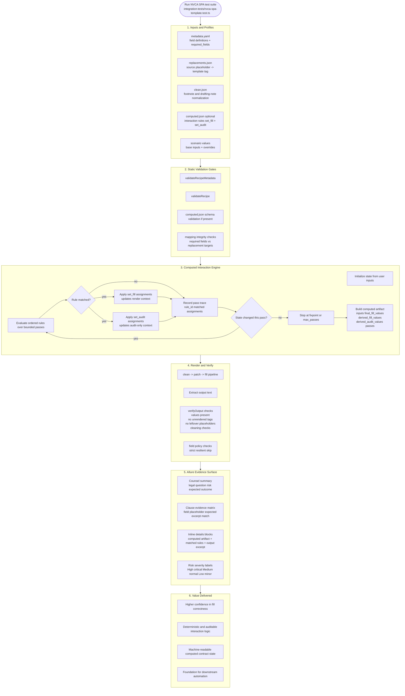
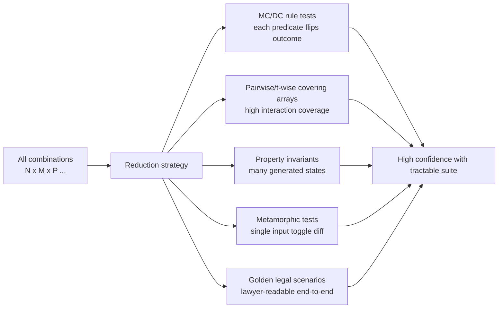
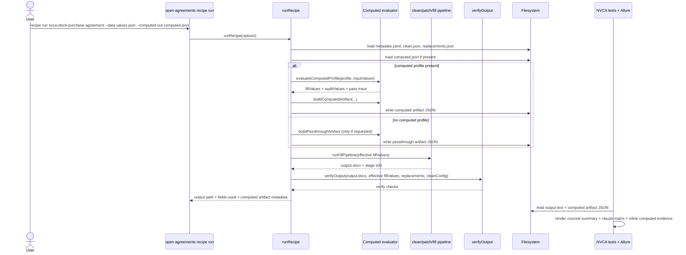
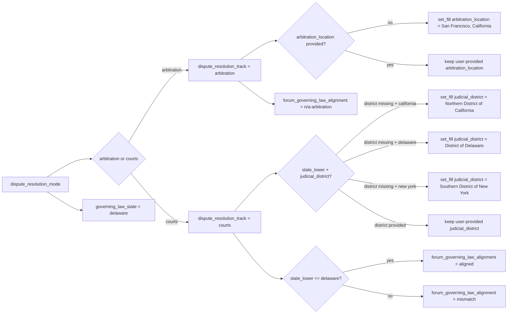

# NVCA SPA Allure + Computed Pipeline Model

This document models the current NVCA SPA test and runtime architecture after adding the computed interaction layer (`computed.json`) and computed artifact export (`--computed-out`).

## Flowchart: End-to-end confidence pipeline

## Flowchart: Combinatorial strategy (without brute force explosion)

## Sequence: `recipe run --computed-out`

## Dependency chain: dispute resolution + governing law (OA-066)

## Why this materially increases confidence

- Interaction logic is no longer implicit; it is declarative, executable, and traced.
- Fill behavior is tested at both levels:
  - output-level document checks,
  - intermediate computed-state checks.
- Rule traces make failures explainable:
  - which rule matched,
  - in which pass,
  - what assignments changed.
- The computed artifact is structured data that can power future automation without re-parsing prose contracts.
