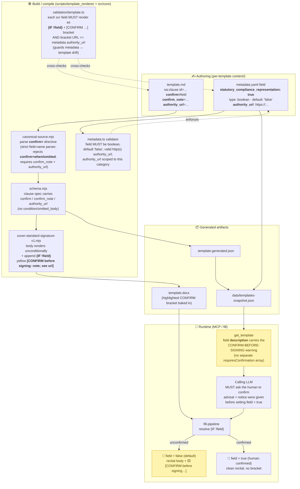

# PR #412 — `statutory_compliance_representation` mechanism

> **What it does:** adds a reusable way to mark a boolean field whose `true` value asserts a *past statutory-compliance fact a human must actually have performed* (e.g. "the 7-day advance notice was given before signing"). Such a clause **always renders**, but until a human confirms, it is followed by a yellow-highlighted `[CONFIRM before signing: … ; see <authority_url>]` bracket — so a generated document never silently asserts unverified compliance, and never silently drops the clause either.
>
> Migrates the Florida CHOICE Act counsel/notice recital (PR #407) off its interim `when=` / `omitted` gate onto this new mechanism. Closes #408.

> **Superseded in part by #413 (SSOT).** PR #412 authored `confirm_note` and `authority_url` in *two* places — the `template.md` `confirm=` directive and the `metadata.yaml` field — kept in sync by a validator drift-check. #413 makes `metadata.yaml` the single source of truth: the directive shrinks to `confirm=<field>`, `confirm_note` becomes a `metadata.yaml` field property (alongside `authority_url`), and the canonical compiler resolves both from the field by reading the sibling `metadata.yaml`. Where the diagram/text below shows `confirm_note`/`authority_url` on the directive, read them as resolved from metadata; the URL/note equality check below is retained but now guards the committed rendered artifact (a stale `template.docx`) rather than two hand-edited files.

## The core idea

| Old (`when=` / `omitted`, PR #407) | New (`confirm=`, PR #412) |
|---|---|
| Field `false` → clause **silently omitted** (`[Intentionally Omitted.]`) | Field `false` → clause body **renders**, plus a highlighted `[CONFIRM before signing …]` bracket |
| Field `true` → clause renders clean | Field `true` → clause renders clean |
| Risk: a reader never sees the unmet obligation | A human always sees the open item before signing |

A `confirm=` clause carries **no** `condition` / `omitted_body` — it is never conditionally dropped.

## How a `confirm=` clause flows through the system

## What changed, by layer

- **Metadata — `src/core/metadata.ts`** — new narrow boolean field category `statutory_compliance_representation: true` requiring an http(s) `authority_url`. Validator enforces `boolean`, `default: 'false'`, valid URL, and scopes `authority_url` to this category only.
- **Renderer — `canonical-source.mjs`, `schema.mjs`, `cover-standard-signature-v1.mjs`** — new `confirm=<field>` clause directive. Body always renders; a `{IF !<field>}`-gated yellow-highlighted `[CONFIRM before signing: <note>; see <url>]` bracket is appended when unconfirmed. Strict field-name parser; mutually exclusive with `when=` / `omitted`; requires `confirm_note` + `authority_url`.
- **Validator — `src/core/validation/template.ts`** — requires every `statutory_compliance_representation` field to render as `{IF !field}` immediately followed by the literal `[CONFIRM …]` bracket, **and** that the bracket URL matches the metadata `authority_url` (catches `metadata.yaml` ↔ `template.md` drift). A bare `{IF !field}` (legacy `when=` output) does **not** satisfy it.
- **`get_template`** — surfaces the warning through the field's own `description`; no new MCP code, no separate `requiresConfirmation` array (everything a user fills already requires confirmation, and the description passes through).
- **Florida migration** — `choice_act_advance_notice_confirmed` + `choice-act-counsel-notice` migrated; clause **id unchanged** so the `legal-context` overlay deeplink stays stable. The by-signing confidential-info acknowledgement and garden-leave clauses stay on `when=` (they are not past-compliance recitals).
- **OpenSpec** — `add-statutory-compliance-representation` (authoring + validation deltas, scenarios OA-TMP-061…064); author guidance in `docs/adding-templates.md`.

## Why it fits the system's design

This is the codification of an existing principle: **multi-factor / real-world judgment lives in the calling LLM, not in template logic.** The template can't know whether a notice was actually given — so instead of guessing (silently omit vs silently assert), it renders a visible, URL-cited CONFIRM bracket and pushes the verification up to the human-in-the-loop via the LLM. The category is deliberately **narrow** (only reps that gate *enforceability*), so ordinary representations in other templates don't all demand per-rep confirmation.

## Verification (from the PR)

- Fill smoke (real DOCX): unconfirmed → recital body **+ highlighted CONFIRM bracket** (verified visually); confirmed → clean recital, no leftover `{IF}` tags.
- `validate`, `lint`, `check:spec-coverage`, `trust:check`, `check:template-previews`, `check:docx-structure`, `check:readme`, `openspec validate --strict` all pass.
- `npm run test:run`: 962 pass (only failures are the pre-existing GCloud-integration flake).
- `generate:template-previews` produces **zero** PNG diffs — the `confirm=` branch is provably inert for all existing templates → merged with the `freshness/skip` label.

---
*Generated to explain [PR #412](https://github.com/open-agreements/open-agreements/pull/412) (merged 2026-06-07).*
